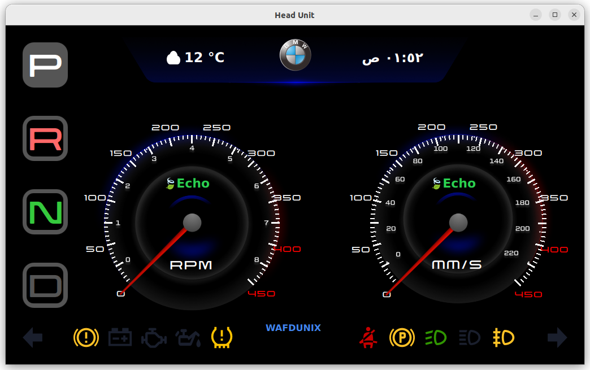
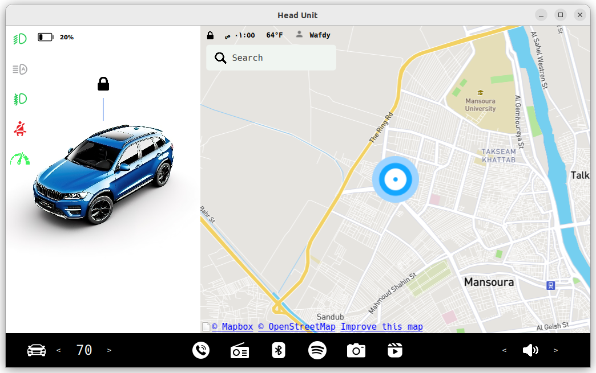
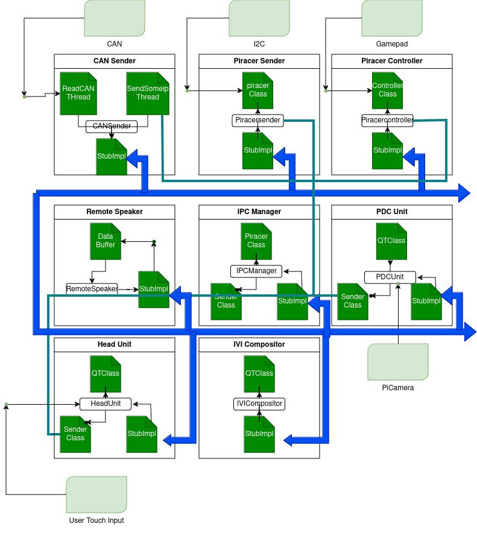

# In-Vehicle Infotainment System

Welcome to the In-Vehicle Infotainment (IVI) system repository! This project demonstrates the development of an advanced IVI system using a Raspberry Pi4, closely mimicking real vehicle functionalities through Inter-Process Communication (IPC) mechanisms. It serves as a practical example of Distributed Embedded Systems principles.

## Project Overview

Our goal is to build a sophisticated infotainment system in a vehicle-like environment. We achieve this using Qt for the embedded GUI and COVESA's vsomeip for IPC, adhering to the AUTOSAR standard. One of the main challenges is ensuring smooth interactions within an operating system developed with Yocto [**meta-infotainment**](https://github.com/AhmedAdelWafdy7/meta-infotainment).

### Head Unit

The implementation of the head unit Qt application on the RPi alongside the instrument cluster app will require the integration of various components, including the use of Yocto as the primary operating system image. The following steps should be taken during the implementation phase:

- Installation of Yocto on the RPi and setup of the necessary tools and dependencies.
- Development of the head unit Qt application and its integration with the instrument cluster app. This will include the implementation of features such as ambient lighting, gear selection, and media app.
- Communication between the head unit and the instrument cluster app will be established using IPC such as vsomeip/autosar.
- The head unit will receive speed data from the speed sensor via CAN, and this data will be processed and displayed on the head unit's display.
- Testing and debugging of the entire system to ensure it meets the technical requirements and operates as expected.
- Final integration and deployment of the head unit and instrument cluster app on the RPi, ready for use in a real-world automotive environment.





### PDC Unit
    
Integrating a Park Distance Control (PDC) system, running on a Raspberry Pi (RPi) inside the head unit. The PDC system will utilize ultrasonic sensors to detect the distance between the vehicle and any obstacles, and provide an audible response to the driver. In addition, the full stack feature development will be integrated into the existing Yocto image, creating a comprehensive and fully functional system. The project aims to provide hands-on experience in developing and integrating advanced driver-assistance features, as well as provide a deeper understanding of the software and hardware involved in modern vehicles.

## Features

- **CAN Communication**: Enables communication with the vehicle's CAN bus.
- **IPC Management**: Handles inter-process communication using vsomeip.
- **Multimedia Control**: Manages audio and video playback functionalities.
- **Embedded GUI**: Developed with Qt for an intuitive user interface.

## Technologies Used

- **Raspberry Pi4**: The hardware platform for the IVI system.
- **Qt**: Framework for developing the embedded GUI.
- **COVESA's vsomeip**: IPC mechanism conforming to the AUTOSAR standard.
- **Yocto**: Framework for developing the operating system.

## Architecture



## Installation

1. Clone the repository:
    ```sh 
    git clone https://github.com/AhmedAdelWafdy7/Infotainment-System.git
    mkdir build && cd build
    cmake ..
    make
    ```

## Key Concepts


### Qt

**Overview of Qt**

Qt is a powerful cross-platform C++ framework for developing both GUI and non-GUI applications. It is known for creating applications that run on various operating systems and includes modules for networking, databases, and graphics.

**Qt Compositor**

Qt Compositor, part of the Qt framework, is used for developing Wayland compositors. It allows developers to create custom compositors for managing application windows on the screen, integrating seamlessly with Qt's robust graphics capabilities.

**Advantages of Qt Compositor for Headunit Development**

- **Modularity**: Manages each application as an independent window, simplifying the addition or removal of applications.
- **Independent Development**: Facilitates separate development and smooth integration of applications.
- **Enhanced User Experience**: Supports seamless transitions and interactions between applications, crucial for driver-focused systems.
- **Resource Efficiency**: Ensures efficient resource management, essential in the resource-constrained environment of automotive systems.

These strengths make Qt Compositor an ideal choice for developing sophisticated and responsive headunit systems.


### vSomeIP & CommonAPI

**vSomeIP**

vSomeIP is the open-source implementation of the SOME/IP protocol, a standard IPC within AUTOSAR. It supports features such as service discovery, service-oriented communication, and event notification, making it ideal for complex automotive systems that require reliable and scalable communication solutions.

**CommonAPI**

Developed by the GENIVI Alliance, CommonAPI standardizes middleware communication in automotive software. It provides an advanced C++ API for developing applications that communicate between various middleware systems within vehicles, such as SOME/IP, DBus, and others. By abstracting the underlying communication mechanisms, CommonAPI allows developers to focus on application logic without worrying about the details of communication protocols.

Together, vSomeIP and CommonAPI are integral to modern automotive software architecture, enabling efficient and standardized communication in complex vehicle systems. We have chosen these IPCs to implement vehicle communication on the Raspberry Pi.


### Yocto Project

The Yocto Project is an open-source initiative designed to create custom Linux-based operating systems. It helps developers easily create Linux distributions tailored for specific hardware, enabling the development of customized Linux environments suitable for a wide range of platforms, including IoT devices, embedded systems, automotive applications, and mobile phones.

I have utilized the Yocto Project to develop a Linux environment optimized for my IVI application. This environment is then compiled into a single image, making it easily accessible for anyone to download and use this optimized Linux image.